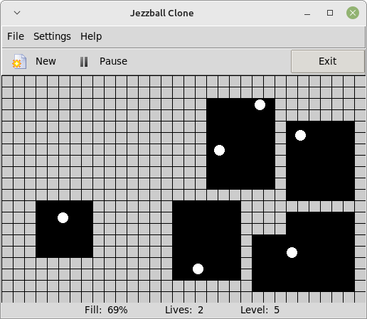

A clone of that game called “Jezzball”
======================================

Just double click on the 'main.pyw' file to run it!

It uses Tkinter, which should be available with a standard Python 
install. If not, for example if using a Linux, it may be available 
in a package such as python3-tkinter. 

Playing the Game
----------------

Each level has an increasing number of balls, starting with 2, and 
each level resets the number of lives depending on the number of balls.
You right click to determine whether to grow the wall vertically or 
horizontally, and click to create a growing wall in said direction. 
If the wall, while growing, gets interrupted and hit by a ball, that 
side of the wall disappears and you lose a life. Empty boxes get filled 
in automatically, which counts towards the total fill percentage. 
